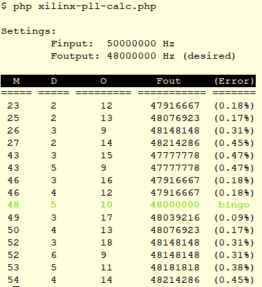

= Find proper parameters for getting desired Frequency by PLL/DCM block of Xilinx FPGA

The `xilinx-pll-calc.php` script print table of proper parameters for desired output frequency (based on known input frequency)  


== Usage

. Customize following variables `$F_input` (Hz), `$F_desired` (Hz) and `$precission` (%) in `xilinx-pll-calc.php`
. Choice proper FPGA family, e.g.: `$FPGA = $SPARTAN6;`
. Run it:
+
```
php xilinx-pll-calc.php
```
+
and looking for bold green string with exactly frequency value:


== Limitation

This script supports following family:
* Xilinx Spartan-6
* Xilinx Virtex-7
* [Add your favourite FPGA. See next chapter]


=== Adding new FPGA family

Xilinx, Altera, Lattice?... Everything can be supported!

The quick and dirty way to adding new family is filling associated array like that:
```
  $VIRTEX7 = array(       
       "FREQ_INP_MIN"  =>   19e6,
       "FREQ_INP_MAX"  =>  800e6,
       "FREQ_VCO_MIN"  =>  800e6,
       "FREQ_VCO_MAX"  => 1600e6,
       "FREQ_OUT_MIN"  => 6.25e6,
       "FREQ_OUT_MAX"  =>  800e6,
       "M_MIN"  => 2,
       "M_MAX"  => 64,
       "D_MIN"  => 1,
       "D_MAX"  => 128,
       "O_MIN"  => 1,
       "O_MAX"  => 56);
```

Use this equation for explanation key name, like: M, D, O, FREQ_INP, FREQ_VCO, FREQ_OUT.
```
                         #######################
  ########################                     #
  #                      #   Useful Folmulae   #
  #                M     #  for PLL Equation   #  
  #   Fvco = Fin * -     #                     #  
  #                D     #######################
  #                                         #
  #          Fvco                      M    #
  #   Fout = ----   or  Fout = Fin * -----  # 
  #            O                      D*O   #
  #                                         #
  ###########################################
```


== Explanation of working

see the source code link:xilinx-pll-calc.php[]

== ToDo

* Mode of chaining two PLL in serial connection (for solving unresolved with single PLL Freq ratio)

== Known issues

not yet known
